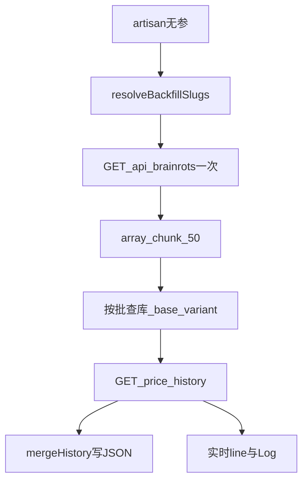

# SAB 价格历史 Backfill

把 rot.rocks 的历史价点补进本站 `storage/app/seo/sab-price-history/{slug}.json`。商品页 30D 曲线和 Today's summary（1 天）都读这些 JSON，**不扫** `seo_item_observations`。

日更 `seo:sab-calculator-refresh` 只合并**当天**点。新商品或空 JSON 需要这条命令补全历史。

计算器 Catalog 不写入本目录。计算器 meta 和物品 Catalog 统一由日更写入 `storage/app/calc/sab/`；本文件只负责商品价格历史。

## 命令

```bash
cd /Users/coolshell/projects/ai2024/sabex-proj

# 全量：所有合格商品（无 --slug 即全量）
php83 artisan seo:sab-price-history-backfill

# 指定商品（可重复 --slug）
php83 artisan seo:sab-price-history-backfill --slug=garama-and-madundung

# 试跑前 N 个 / 调整限流
php83 artisan seo:sab-price-history-backfill --limit=5
php83 artisan seo:sab-price-history-backfill --sleep-ms=200
```

| 参数 | 默认 | 说明 |
| --- | --- | --- |
| `--slug=*` | 空 = 全量 | 只处理指定 slug |
| `--all` | — | 与无 `--slug` 等价，兼容旧用法 |
| `--sleep-ms` | `150` | 每次打完 price-history API 后等待，避免 rot.rocks 限流 |
| `--limit` | `0`（不限） | 只处理解析后的前 N 个 slug |

## 全量范围

`SabRotCalculatorSyncService::resolveBackfillSlugs()` 同时满足：

1. 本地游戏 `steal-a-brainrot`（`seo_game_id`）
2. `attributes_json.rot_rocks.rot_id` 非空
3. slug 出现在 rot.rocks `GET /api/brainrots` 目录里

不再写死 `strawberry-elephant` / `garama-and-madundung`。无 `rot_id`、或远程目录没有的商品不会进队列。

## 实时日志

边跑边 `line`，不等全部 HTTP 结束。Laravel 日志 channel：`seo.sab-price-history-backfill.progress`。结束汇总另写 `seo.sab-price-history-backfill`（`written` / `skipped` / `item_count`）。

典型顺序：

```
Starting backfill (561 slugs)...
Fetching remote catalog...
Batch 1/12 (slugs 1–50)...
[ok] extra-backfill-item: 12 points, latest=12
Processing 1/561
[skip] some-slug: no_base_variant
Processing 2/561
...
Written=540 skipped=21
```

`[skip]` 原因：

| reason | 含义 |
| --- | --- |
| `local_item_missing` | 本库没有该 slug（或不是本游戏） |
| `no_base_variant` | 没有 `variant_key=base` / `variant_type=base` |
| `no_rot_id` | 本地和远程都拿不到 rot id |
| `fetch_failed: ...` | 拉 `/api/brainrots/{rotId}/price-history` 失败 |
| `empty_history` | 响应没有有效 `date` + 数值 `value` |

## 分批 SQL

常量 `BACKFILL_CHUNK_SIZE = 50`。不要一次 `whereIn` 几百个 slug，也不要 eager 全部 variant / `currentValues`。

每批：

```php
SeoItem::query()
    ->where('seo_game_id', $game->id)
    ->whereIn('slug', $chunk)
    ->select(['id', 'slug', 'attributes_json'])
    ->with(['variants' => function ($q) {
        $q->where(function ($q) {
            $q->where('variant_key', 'base')
                ->orWhere('variant_type', 'base');
        })->select(['id', 'seo_item_id', 'variant_key', 'variant_type']);
    }])
    ->get()
    ->keyBy('slug');
```

约束：

- `/api/brainrots` 同一命令只打一次（`remoteItemsBySlug` 内存缓存）
- 每个 slug 再打 `/api/brainrots/{rotId}/price-history`，然后 `sleep-ms`
- **不写** `seo_item_observations`
- 响应有数值 `latestPrice` 时，`updateOrCreate` 到 `seo_item_current_values`（来源 `rot-rocks-calculator`）
- `resolveBackfillSlugs()` 只取 `id/slug/attributes_json`，在 PHP 里按 `rot_id` + 远程目录过滤



## 写入格式与下游

文件：`storage/app/seo/sab-price-history/{slug}.json`

```json
{
  "slug": "garama-and-madundung",
  "variants": {
    "1001": [
      { "date": "2026-06-08", "value": 135 },
      { "date": "2026-06-09", "value": 139 }
    ]
  }
}
```

`variants` 的 key 是**当前** base variant 的数据库 id。`mergeHistory` 按日期 upsert，不删其它 variant key 上的历史点。

| 下游 | 怎么读 |
| --- | --- |
| 商品页 30D | 前端 `fetch` `GET /products/{slug}/price-history.json`（`SabPublicController::itemPriceHistory`），服务端读 JSON 后截近 30 天 |
| Today's summary（`days=1`） | `SabValueChangesService` 直接读 JSON：今天 vs 今天之前最后一个点 |
| `days > 1` 的变动榜 | 仍走 `seo_item_observations` + `LAG()` |

## 相关代码

| 位置 | 职责 |
| --- | --- |
| `routes/console.php` | 命令：无 `--slug` 调 `resolveBackfillSlugs()`，传入 `$this->line` |
| `SabRotCalculatorSyncService` | `resolveBackfillSlugs` / `backfillPriceHistory` / `reportBackfillProgress` |
| `SabPriceHistoryWriter::mergeHistory` | 按 variant 合并历史点到 JSON |
| `tests/Feature/SabPriceHistoryBackfillTest.php` | `--slug` 单条、无参全量、实时输出 |

```bash
php83 artisan test --filter=SabPriceHistoryBackfillTest
```

## 运维

- 合格 slug 大约 500+。默认 150ms sleep，全量大约数分钟到十几分钟，看 rot.rocks 延迟。
- 先 `--limit=5` 看日志和 JSON 再全量。
- GEOFlow 同步**不要**覆盖 `sab-price-history/`。观测表有数据也不等于曲线有数据。
- 不执行 `migrate` / `DELETE`。失败单条 skip，不中断整批。
